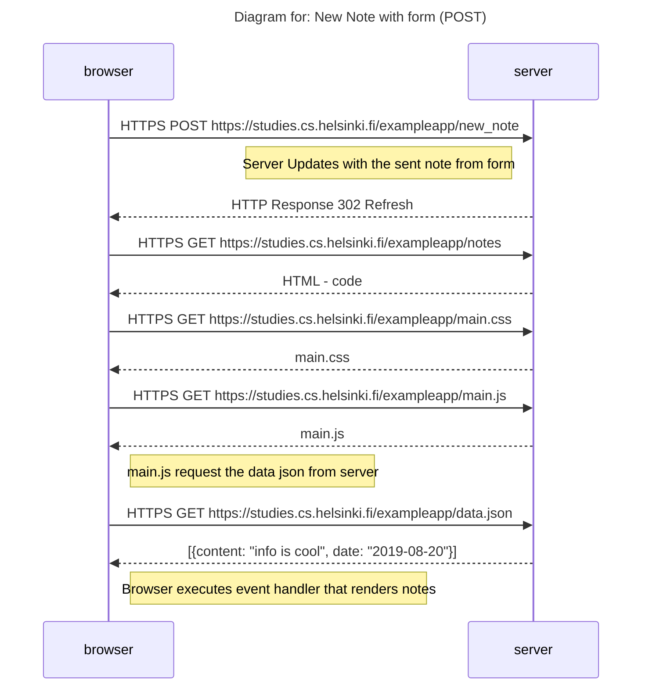

```mermaid
sequenceDiagram
    title Diagram for: New Note with form (POST)
    
    browser->>server: HTTPS POST https://studies.cs.helsinki.fi/exampleapp/new_note
    Note left of server: Server Updates with the sent note from form
    server-->>browser: HTTP Response 302 Refresh
    browser->>server: HTTPS GET https://studies.cs.helsinki.fi/exampleapp/notes
    server-->>browser: HTML - code
    browser->>server:  HTTPS GET https://studies.cs.helsinki.fi/exampleapp/main.css
    server-->>browser: main.css
    browser->>server:  HTTPS GET https://studies.cs.helsinki.fi/exampleapp/main.js
    server-->>browser: main.js
    Note right of browser: main.js request the data json from server
    browser->>server:  HTTPS GET https://studies.cs.helsinki.fi/exampleapp/data.json
    server-->>browser: [{content: "info is cool", date: "2019-08-20"}]
    Note right of browser: Browser executes event handler that renders notes
```

